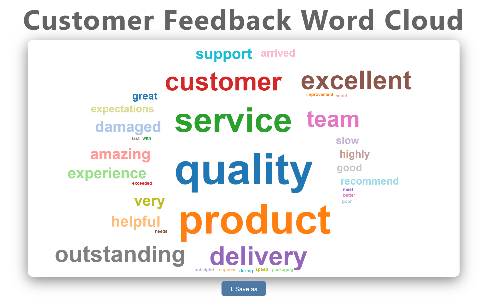
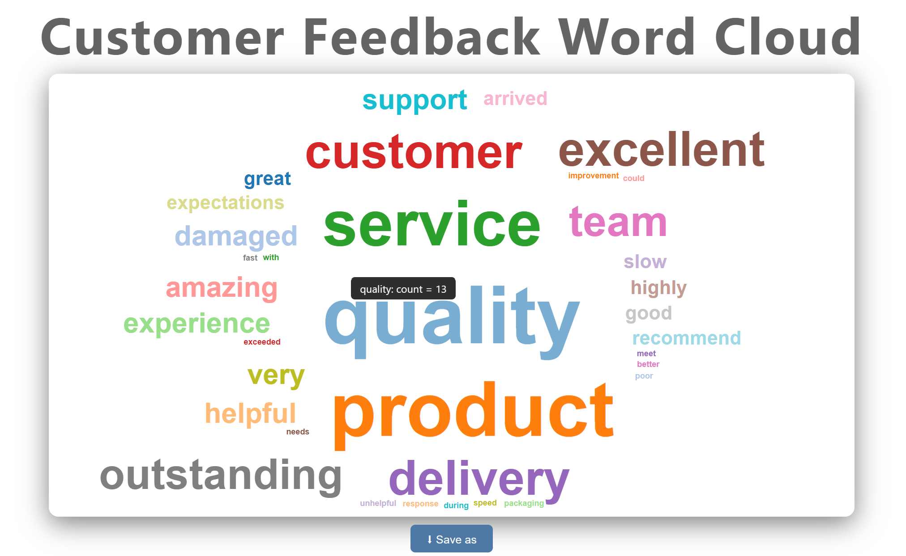

# wordcloud2 - Interactive Word Cloud for Stata

> **Beta** · v1.2.0 · Built by [Fahad Mirza](https://github.com/fahad-mirza/) · Co-developed with [Claude](https://www.anthropic.com) (Anthropic)

`wordcloud2` is a Stata command that reads a string variable containing free text, counts word frequencies across all observations, and renders the results as a fully interactive, self-contained HTML/SVG word cloud. No external software, no Python, no R. Open the output in any modern browser and it just works.

---

## Output preview

**Example 1: Default output**



**Example 2: Interactive tooltip on hover**



> Screenshots generated from the [example do-file](wordcloud2_example.do) using the built-in synthetic survey dataset.

---

## Features

- **Collision-free layout**: Archimedean spiral + AABB collision detection ensures words never overlap, mirroring the algorithm used by Python's `amueller/word_cloud`
- **Interactive HTML output**: hover any word to see its exact frequency count in a tooltip
- **In-browser static export**: embed a one-click download button for PNG, JPG, or SVG without leaving the browser
- **Full color control**: set background color and title color using any CSS value (hex, named, `rgb()`, `rgba()`, `hsl()`)
- **Palette integration**: plug in any palette from Ben Jann's [colorpalette](https://repec.sowi.unibe.ch/stata/palettes/) package by name
- **Font size scaling**: sizes mapped on the square root of frequency so rare words stay legible
- **Built-in English stopwords**: based on the `amueller/word_cloud` default list, fully suppressible
- **Safe by design**: uses `preserve`/`restore` internally; your dataset is never modified

---

## Installation

Place `wordcloud2.ado` and `wordcloud2.sthlp` in your personal ado path. To find yours:

```stata
adopath
```

Typical locations:

| OS | Path |
|---|---|
| Windows | `C:\ado\personal\` |
| Mac / Linux | `~/ado/personal/` |

Or add the folder containing the files to your adopath for the session:

```stata
adopath + "C:\path\to\your\folder"
```

### Optional dependency - color palettes

To use the `palette()` option, install Ben Jann's packages from SSC:

```stata
ssc install palettes, replace
ssc install colrspace, replace
ssc install moremata, replace
```

---

## Syntax

```stata
wordcloud2, textvar(varname) [options]
```

### Options

| Group | Option | Description | Default |
|---|---|---|---|
| **Required** | `textvar(varname)` | String variable containing free text | — |
| **Text processing** | `maxwords(#)` | Maximum words to display | `100` |
| | `minfreq(#)` | Minimum word frequency to include | `2` |
| | `minlength(#)` | Minimum word character length | `3` |
| | `stopwords(string)` | Extra stopwords (space-delimited) | — |
| | `nostopwords` | Suppress built-in English stopword list | — |
| | `noclean` | Suppress lowercasing and punctuation removal | — |
| **Appearance** | `title("text"[, color() size()])` | Chart title with optional color and size | `"Word Cloud"` |
| | `width(#)` | Canvas width in pixels | `900` |
| | `height(#)` | Canvas height in pixels | `500` |
| | `margin(#)` | Minimum gap between words in pixels | `6` |
| | `maxfontsize(#)` | Font size of the most frequent word | `80` |
| | `minfontsize(#)` | Font size of the least frequent word | `10` |
| | `bgcolor(color)` | Background color (any CSS value) | `#16213e` |
| | `palette(name)` | Color palette name from `colorpalette` | built-in tab10 |
| **Output** | `savefile(filename)` | Output HTML file path | `wordcloud2.html` |
| | `export(format)` | Embed download button: `png`, `jpg`, or `svg` | — |

---

## Color formats

Both `bgcolor()` and the `color()` sub-option of `title()` accept any CSS color. No extra quotation marks needed around the value.

```stata
bgcolor(#16213e)           * hex
bgcolor(white)             * named color
bgcolor(rgb(0, 30, 60))    * RGB
bgcolor(rgba(0,30,60,0.9)) * RGBA with alpha
bgcolor(hsl(220,60%,15%))  * HSL
```

The `title()` option takes the text first, then optional sub-options after a comma:

```stata
title("My Title")
title("My Title", color(#ff6b6b))
title("My Title", size(2em))
title("My Title", color(rgb(0,128,255)) size(2em))
title("My Title", size(28px) color(navy))
```

`size()` accepts any CSS font-size value. A plain number is treated as `em`.

---

## Color palettes

Any palette name accepted by Ben Jann's `colorpalette` package can be used. `wordcloud2` calls `colorpalette name, n(nplaced) nograph` internally, so the palette is automatically interpolated or cycled to exactly as many colors as words were placed.

Some commonly used palettes:

| Name | Description |
|---|---|
| `Set1` | ColorBrewer qualitative - high contrast |
| `Set2` | ColorBrewer qualitative - pastel |
| `Dark2` | ColorBrewer qualitative - darker tones |
| `Accent` | ColorBrewer with accents |
| `tableau` | Tableau 10 (Tableau's default palette) |
| `viridis` | Perceptually uniform, blue-green-yellow |
| `plasma` | Perceptually uniform, purple-orange |
| `magma` | Perceptually uniform, black-purple-yellow |

If `colorpalette` is not installed or the palette name is unrecognised, `wordcloud2` falls back to its built-in Tableau-inspired ten-color palette and prints a warning.

---

## Examples

All examples below use this synthetic dataset of open-ended survey responses:

```stata
clear
input str200 response
"The product quality is excellent and the service was outstanding"
"Great quality but delivery was slow and customer service needs improvement"
"Amazing experience with the product and very helpful support team"
"Poor quality product arrived damaged and customer service was unhelpful"
"Outstanding quality and excellent delivery speed highly recommend"
"The service team was helpful but the product quality could be better"
"Excellent customer experience product quality exceeded my expectations"
"Good quality product but packaging was damaged during delivery"
"Highly recommend excellent quality and very fast delivery service"
"The support team was amazing and the product quality is outstanding"
"Product quality is good but customer service response was very slow"
"Great delivery service but product quality did not meet expectations"
"Excellent quality product and outstanding customer service experience"
"The product arrived damaged but the customer service team was helpful"
"Amazing support team excellent delivery and outstanding product quality"
end
```

### Example 1: Basic call, all defaults

```stata
wordcloud2, textvar(response)
```

Outputs `wordcloud2.html` in the current directory. Built-in English stopwords are applied, words appearing fewer than twice are dropped, and the built-in ten-color palette is used on a dark navy background.

### Example 2: Full customisation with PNG export

```stata
wordcloud2,                                               ///
    textvar(response)                                     ///
    maxwords(80)                                          ///
    minfreq(1)                                            ///
    minlength(4)                                          ///
    title("Customer Feedback Word Cloud",                 ///
          color(rgb(100,100,100)) size(4))                ///
    palette(tableau)                                      ///
    width(1000)                                           ///
    height(550)                                           ///
    margin(1)                                             ///
    maxfontsize(100)                                      ///
    minfontsize(10)                                       ///
    nostopwords                                           ///
    bgcolor(rgb(255,255,255))                             ///
    savefile("feedback_cloud.html")                       ///
    export(png)
```

To open the output in your default browser after running:

```stata
* Windows
shell start feedback_cloud.html

* Mac
shell open feedback_cloud.html

* Linux
shell xdg-open feedback_cloud.html
```

### Example 3: Title and color variations

```stata
* Default title styling
wordcloud2, textvar(response) title("Customer Feedback")

* Colored title on dark background
wordcloud2, textvar(response) ///
    title("Customer Feedback", color(#ff6b6b) size(2em)) ///
    bgcolor(#1a1a2e)

* RGB title color on white background
wordcloud2, textvar(response) ///
    title("Customer Feedback", color(rgb(0,128,255)) size(2em)) ///
    bgcolor(white)
```

### Example 4: Color palettes

```stata
wordcloud2, textvar(response) palette(Set1)

wordcloud2, textvar(response) palette(Dark2) bgcolor(white)

wordcloud2, textvar(response) palette(viridis) bgcolor(#16213e)
```

### Example 5: Filtering and stopwords

```stata
* Raise thresholds to reduce noise
wordcloud2, textvar(response) minfreq(3) minlength(5)

* Suppress built-in list entirely (e.g. for non-English text)
wordcloud2, textvar(response) minfreq(1) nostopwords

* Add domain-specific stopwords on top of the built-in list
wordcloud2, textvar(response) stopwords(product service) minfreq(2)
```

### Example 6: Static export formats

```stata
wordcloud2, textvar(response) savefile(feedback_cloud.html) export(png)
wordcloud2, textvar(response) savefile(feedback_cloud.html) export(jpg)
wordcloud2, textvar(response) savefile(feedback_cloud.html) export(svg)
```

### Example 7: Using your own data

```stata
use "your_survey_data.dta", clear

wordcloud2,                                  ///
    textvar(open_ended_comments)             ///
    maxwords(120)                            ///
    minfreq(3)                               ///
    title("Open-Ended Survey Responses")     ///
    savefile("survey_wordcloud.html")
```

---

## How it works

`wordcloud2` processes text in ten sequential steps. Your dataset is never modified — the command uses `preserve`/`restore` throughout.

1. **Concatenation** - all observations are joined into a single string via a Mata routine (`wc_concat_rows`), avoiding Stata macro length limits
2. **Cleaning** - text is lowercased and non-alphabetic characters are replaced with spaces (suppressed by `noclean`)
3. **Tokenisation** - the master string is split on whitespace using Mata's `tokens()`, giving one word per observation
4. **Stopword filtering** - the built-in English stopword list is applied (suppressible via `nostopwords`), plus any words in `stopwords()`; words below `minlength` are dropped
5. **Frequency counting** - unique words are counted with `contract`, filtered by `minfreq`, sorted descending, and capped at `maxwords`
6. **Font sizing** - sizes are linearly mapped on the **square root** of frequency onto [`minfontsize`, `maxfontsize`], so rare words stay legible
7. **Bounding boxes** - each word's pixel box is estimated from font size and character count, padded by `margin`
8. **Layout** - a Mata routine (`wc_place_words`) places words largest-first along an Archimedean spiral from the canvas centre, with AABB collision detection; unplaceable words are silently omitted
9. **Color assignment** - colors come from `colorpalette` if installed and `palette()` is set, otherwise from the built-in ten-color palette
10. **HTML output** - a self-contained HTML file is written with the SVG cloud, hover tooltip JavaScript, and (if `export()` is set) the in-browser raster or SVG export function

---

## Requirements

| Requirement | Version / Notes |
|---|---|
| Stata | 15 or later (`ustrregexra` and `strL` support required) |
| colorpalette | Optional - for `palette()` option; install via `ssc install palettes` |
| colrspace | Optional - required by colorpalette; install via `ssc install colrspace` |

---

## Repository structure

```
wordcloud2_stata/
├── wordcloud2.ado          # Main command
├── wordcloud2.sthlp        # Stata helpfile (type: help wordcloud2)
├── wordcloud2_example.do   # Example do-file with synthetic data
├── screenshots/
│   ├── Wordcloud_Example_1.png   # Default dark-background output
│   └── Wordcloud_Example_2.png   # Interactive tooltip on hover
└── README.md
```

---

## Authors

**Fahad Mirza** (Author)

[](https://www.linkedin.com/in/fahad-mirza/)
[](https://medium.com/@fahad-mirza)
[](https://github.com/fahad-mirza/)

**Claude** (Anthropic) | Editor and co-developer. This program was built collaboratively between the author and Claude, which assisted with algorithm implementation, debugging, and feature development throughout.

---

## Note

`wordcloud2` is currently in **Beta**. The core functionality is stable but improvements, new options, and refinements are planned over time. Feedback and bug reports are welcome - please open an issue on this repository.

---

## License

See [LICENSE](LICENSE) for details.

---

*Also see: [colorpalette documentation](https://repec.sowi.unibe.ch/stata/palettes/) by Ben Jann*
